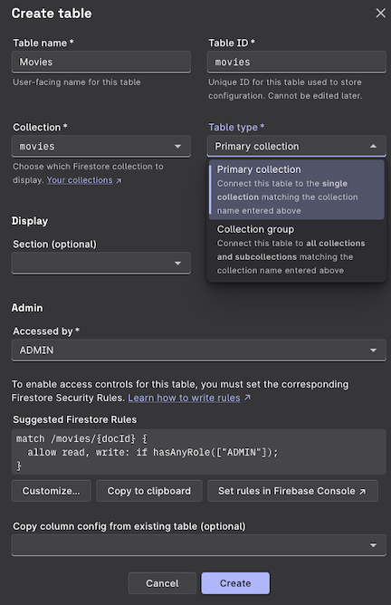
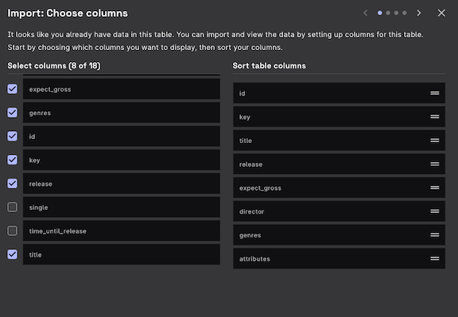
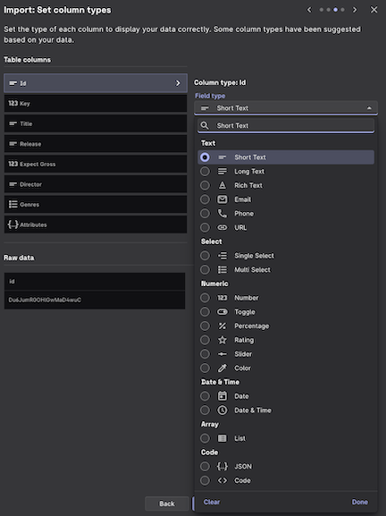
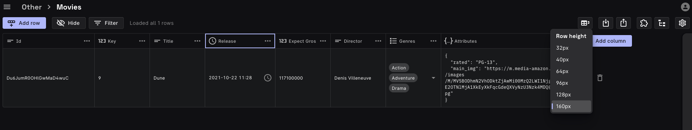
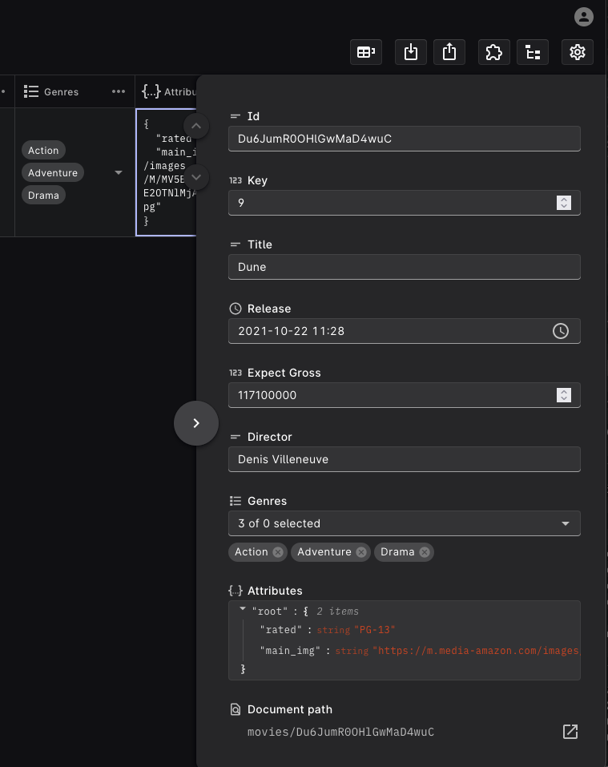
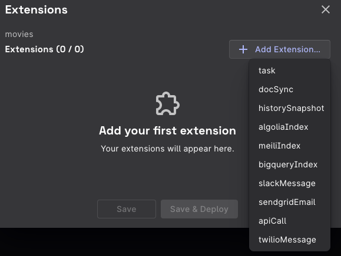
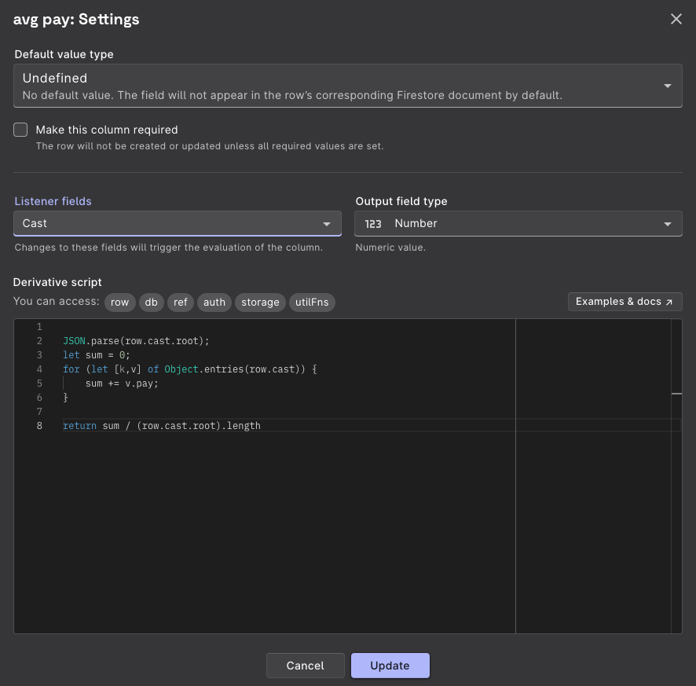
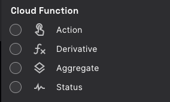
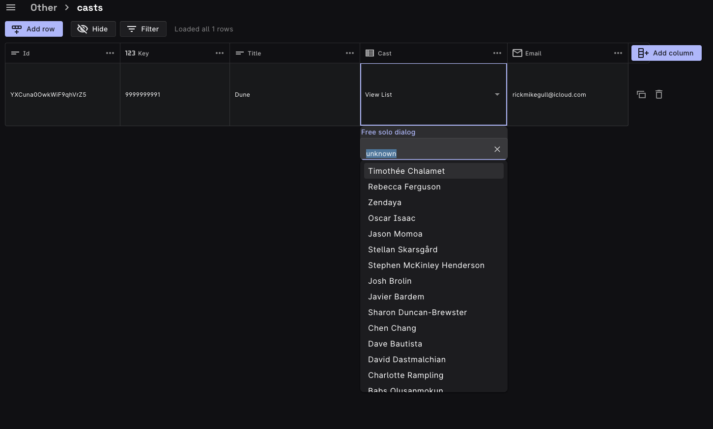

## Overview Rowy

Rowy advertises as a platform that displays data from a firestore database. It
allows for each column to be represented as around 30 different types including
datetime, rating, phone, images and email. They also have an open-ended feature
which allows the user to insert their own code to interact with firebase. This
feature uses cloud functions and CRUD listeners on the database and, when a
value is created, updated, or deleted, the user-defined code runs and can do
anything to the database, aggregate values, send alerts in form of email or
message, or do a fetch api call to any open api. All of thse features,
especially the user-defined code, make Rowy seem like an amazing idea that could
be a and ideal tool for someone who needs to manage a fair amount of data and
wants to visualize and manage it, but doesn't know how to code. The idea in my
head is that a company can contract hire one person to manage the tables and add
to their user-defined code to fit the companies needs. The company would hire
less technical employees to actually interact with the table and manage
operations. This all sounds like a great idea, but I mostly had a very
problematic time working with Rowys features. I will detail below, but overall,
Rowy harbors a large handful of serious bugs, it's features conditionally work
and are very clunky and restrictive, and the UI is done poorly and difficult to
interact with. Below has three sections, my user experience, known bugs, and
developer experience. I will then sum up what I've found and my overall
thoughts.

## User Experience

Rowy is very portable and requires no download. Launching follows the following
steps,

- The user clicks a link on the Rowy Github
- Redirect to Google cloud console
- The user selects a project id and cloud region
- Rowy compiles creates a collection in the users firestore called `_rowy_`,
  which logs configurations, tables, and user management.
- A link to the running project is displayed on the console

  

excuse the enormous pictures, but it turns out hard to get high quality image
hosting. My original img imports from google and sites are all bad quality.

In picture two you can see the add table ids page. You'll see I have many more
fields than I selected. That's because everytime the user adds a column in rowy,
the database is updated with a new data field. This is automatic and when you
delete a column in rowy, it persists in the database. This feature should have
more control to it such as clean up when a column is deleted.

In the third picture you can see all the immediate field types in Rowy plus an
added List type that I created. If a user is code savvy they can add any field
type they can envision. I will detail that process later.

The final result looks like this...

 

### Basic Features

The table display is very restricted.

- The row height field you see is the maximum display height. The cells are not
  scrollable which, if they were, could raise issues when scrolling the page. I
  would suggest a debouncer to make ensure page scroll would be possible after
  moving cells.
- They have a simple filter which can compare a cell value to a static value. <=
  == >= > <, oddly there is no !=
- As shown above, the table page has a "side drawer" component which can be
  opened to edit all values
- Each cell is also editable on click, this feature is dangerous because if a
  user accidentally presses a key, the change will propogate back to the
  database. I suggest a change tracker with an "are you sure" feature.
- There is a helpful, built-in log feature(alpha) where you can track actions
  such as cloud functions and table building.
- They also support uploading from csv which is a smart idea for people who want
  to change from a different database scheme.

  

### Cloud Function Features (Rowy Run)

Rowy's most appealing feature are its cloud function columns. They are CRUD
based functions that RowyRun loads onto the users gcp profile. The concept seems
very powerful. Action acts like a button and each time the user clicks it, a
scripted function occurs. Derivative monitors a field and then executes a script
each time the field is created, deleted, or modified. Aggregate is meant to
aggregate values from Rowy's sub-table feature. And status is meant to monitor a
field on condition. There are also extensions the user can add which can send
messages, api call, simple task, create index, or track state. A feature I love
is that each user-defined code textfield includes many firebase objects such as
storage (Storage), ref (DocRef), auth, and db (Firestore). This allows the user
to pretty much do anything given a CRUD listener.

#### My Experience with Rowy Run

My experience with Rowy Run was very painful. I started with derivative and
found that it did not work even if I simply return 10. It drove me crazy, and I
tried everything, so I joined the Rowy Discord and asked about it. They ran me
through many checks and everything seemed find. To no avail I gave up and tried
a day later. While I was tinkering with it and checking logs, all of a sudden it
started working. This has been a buggy, conditional thing ever since, and it
seems like derivative working is based on luck. Action was the only reliable one
because it requires a click. Aggregate is very obscure and it is not clear on
their docs how it's used. Status sometimes causes a non-recoverable error, which
is simply caused by creating it. The extensions I tried are task, algolia index,
and api call. All others require a subscription. Task and ApiCall are very
similar to derivative, therefore they could be amazing but are not very
reliable. Algolia Index is Rowys way of linking two fields together with a
foreign key. I think it is painful to use and would suggest that a user just set
their own keys, which is usually done in sql and nosql for association.

## Rowy Pros and Cons

### Pros

- It offers a distributable, updatable SaaS template
- It has a goal of some very powerful features
- It can save the money of many companies by allowing non-technical employees to
  perform data tasks
- Import and Export from CSV
- Extensions that can perform business tasks such as sms and email to customers
- Allows for easy deployment of cloud functions
- It allows for multiple, different tables based on needs of the task
- Import from other tables in order to hide sensitive data
- Done with Material UI which I love
- Simple log file feature (con, not enough)

### Cons

- Buggy with no recover from an error
  - I changed a column type which threw an error. I had to end up deleting the
    table
  - Creating a simple column can also lead to an error which is not recoverable
- It does not work with large data sets on firefox and on chrome the
  user-defined code field will not load
- The filter functions on data are limited
- It is too easy to modify data that instantly propogates to the database and
  could lead to false values
- There are no helpful messages when an exception occurs
- The documentation is very limited
- Cell and table view options are limited which results in hard to see data
- The single-select and multi-select types are extremely buggy and do not work
  with already defined lists (honestly they need to scrap the whole thing and
  restart)

Overall it feels like an application made to simplify data for non-technical
people, but they actually made it more for people who can kind of code but not
too well. I would much prefer to use other methods such as actual queries and
statistical programs for my data. And someone who doesn't know how to code may
feel like it's too hard and buggy for them. I can see this company making this
software very popular with some changes, but as I will get to in the next
section, their codebase may prevent that from happening.

## Bugs

I've already covered many of their bugs, but they have many more. On their repo
there is 57 open bugs, mostly from the past 3 weeks. Oddly enough, they seem to
be more focused on small issues rather than addressing their handful of huge
ones. They also use their issues section to list features they want to add. I
find this to be odd, and I think that it will ruin their development process due
to lack of organization.

## Development Experience

On Rowy docs, they advertise being able to add your own features. This sounds
awesome because a company or individual would think they can always fit their
needs I had the idea of creating a List field which would take Json arrays and
display them in a dropdown list if clicked. I dug into the code for many days
figuring out their data flow and config. On their site, they only cover the most
minimal knowledge one should know if adding a field. Basically what it comes
down to is They have three cell types, a basic, heavy, and popover cell. These
come with config listener and function files ie "withPopoverCell.tsx". Each
field also has an editor function which controls what happens when a user
double-clicks a field. These types are TextEditor, withSideDrawerEditor, and
NullEditor. Last, each field has a sideDrawerFied.tsx file which handles how the
value is displayed in the side window. All of this sounds good but even when
reading their guide, I knew it was going to be a very rescrited experience. I
wanted to cover the entire project, so I mapped the data flow.

- The initial setup begins in the Setup file with a 6-step process split amoung
  files
- When creating a new table, their Wizards/ImportWizard performs 4 steps (the
  windows). This maps everything to the rowy collection on user gcp`
- When the user opens the table to view, a series of actions begin with
  creating` a grid to using many table funcitons all the way down to individual
  cell
  - The useTableData.tsx specifically puts a listener function on each cell
    corresponding to one of their predefined editor and cell functions
    - useTableData uses useReducer() in react to monitor for changes to the data
      and perform firebase functions on create, destroy, or modify
- The data is simultaneously populated from firestore

### Adding my Class

The idea is simple. Create a cell type that reads Json arrays and displays them
in drop-down. I also want to add a feature that allows a cloud function to be
set and then when an item is selected and the user presses enter, it runs the
function. I started off well, added a class and got a nice list to show but
realized there were some major issues. Each editor value and cell type were
resulting in different bugs. Just as I had thought, I was very restricted from
my vision. I continued to play around with it and read more code only to become
restricted by the base functionality of Rowy. I was running into interaction and
detailed display problems due to the way Rowy performs by default. This is very
frusterating to me, and I believe that a cell type should be independent of the
grid. Meaning each type defines all of their own behavior and is not limited to
a global functionality. Their current design does not allow for maximum growth
and restricts possibilites. I also think that it raises the potential of bugs to
occur, especially unseen ones. I am still having fun with this project and plan
to have something which works well up within the next couple of days. It is
defined in the fields/List folder, but I will also post pictures here soon.

### Pros

- An open code base means that the client is not limited and can make additions
  to the services as time goes
- Rowy has a discord channel where people are responsive to help people
- Their typescript compiler is easy to work with and does not have as many
  components as a typical web service

### Cons (unfortunately, I have much more)

- No testing files except two simple end-to-end test files
- Very limited ability to debug because craco has limited dev features. Browser
  debugging is available
- The project is way too modular and props are passed a dozen at a time through
  10+ different functions
- Props are obscure, listeners and handle functions are defined at a much higher
  level then where they are used
- They change names of imports, so they are very difficult to find based off
  export name
- Their class structure is extremely limited (I guess you could say its top-down
  pre-defined structure instead of a bottom-up customizable structure)
- The project is reliant upon pre-defined interfaces, which I agree with, but
  they went overboard
- There are just about no comments on the code

This is what I have so far but, as said before, the nature of how Rowy functions
is limiting a quick development.

Overall, I think you can learn about what not to do from learning the Rowy
codebase, but they do have a few, potentially very powerful features when
interacting with Firebase. I am posting this readme now, but I plan to learn
just how the functionality for sharing firestore variables and executing
user-defined code is implemented.

 
 
 
 
 
 
 
 
 
 
 
 
 
 
 
 
 
 
 
 
 
 
 
 
 
 
 
 
 
 

<h1 align="center">
✨ GCP as easy as ABC ✨  
</h1>
<h3 align="center">
Build on Google Cloud Platform in minutes
</h3>

Manage Firestore data in a spreadsheet-like UI, write Cloud Functions effortlessly in the browser, and connect to your favorite third party platforms such as SendGrid, Twilio, Algolia, Slack and more. 

    <a href="http://www.rowy.io"><b>Website</b></a> •
    <a href="http://docs.rowy.io"><b>Documentation</b></a> •
    <a href="https://discord.gg/B8yAD5PDX4"><b>Discord</b></a> • 
    <a href="https://twitter.com/rowyio"><b>Twitter</b></a>

## Live Demo

💥 Check out the [live demo](https://demo.rowy.io/) of Rowy 💥

## Quick Deploy

Set up Rowy on your Google Cloud Platform project with this one-click deploy
button.

## Documentation

You can find the full documentation with how-to guides
[here](http://docs.rowy.io/).

## Features

### Powerful spreadsheet interface for Firestore

- CRUD operations
- Sort and filter by row values
- Lock, Freeze, Resize, Hide and Rename columns
- Multiple views for the same collection
- Bulk import or export data - csv, json

### Supercharge your database with cloud functions and ready made extension

- Effortlessly build cloud functions on field level triggers right in the
  browser
  - Use any NPM modules or APIs
- Connect to your favourite tool with pre-built extensions or create your own
  - SendGrid, Algolia, Twilio, Bigquery and more

### Rich and flexible data fields

- [30+ fields supported](https://docs.rowy.io/field-types/supported-fields)
  - Basic types: Short Text, Long Text, Email, Phone, URL…
  - Custom UI pickers: Date, Checkbox, Single Select, Multi Select…
  - Uploaders: Image, File
  - Rich Editors: JSON, Code, Rich Text (HTML)
- Data validation, default values, required fields
- Action field: Clickable trigger for any Cloud Function
- Aggregate field: Populate cell with value aggregated from the row’s sub-table
- Connect Table: Get snapshot of data from another data table using Algolia
- Connect Service: Get data from any HTTP endpoint

### Collaborate with your team

- Granular table-level and field-level permission control  
  with custom user roles
- Built in user management
- Customizable views for different user roles

## Install

Set up Rowy on your Google Cloud project with this one-click deploy button.

The one-click deploy makes the process of setting up easy with a step by step
guide and ensures your project is setup correctly.

It deploys [Rowy Run](https://github.com/rowyio/rowyrun), an open-source Cloud
Run instance that operates exclusively on your GCP project. So we never have
access to your service account or any of your data.

Alternatively, you can manually install by
[following this guide](https://docs.rowy.io/setup/install).

## Join our community

We would love to connect and hear what you think!

- [Discord](https://discord.gg/B8yAD5PDX4)
- [Twitter](https://twitter.com/rowyio)
- [Email](mailto:rowy.io)
